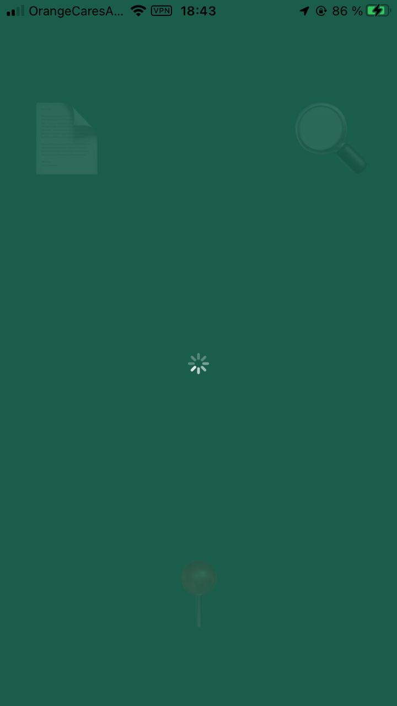
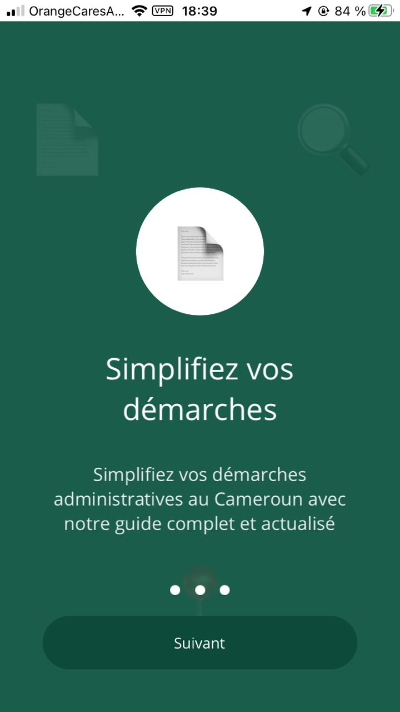
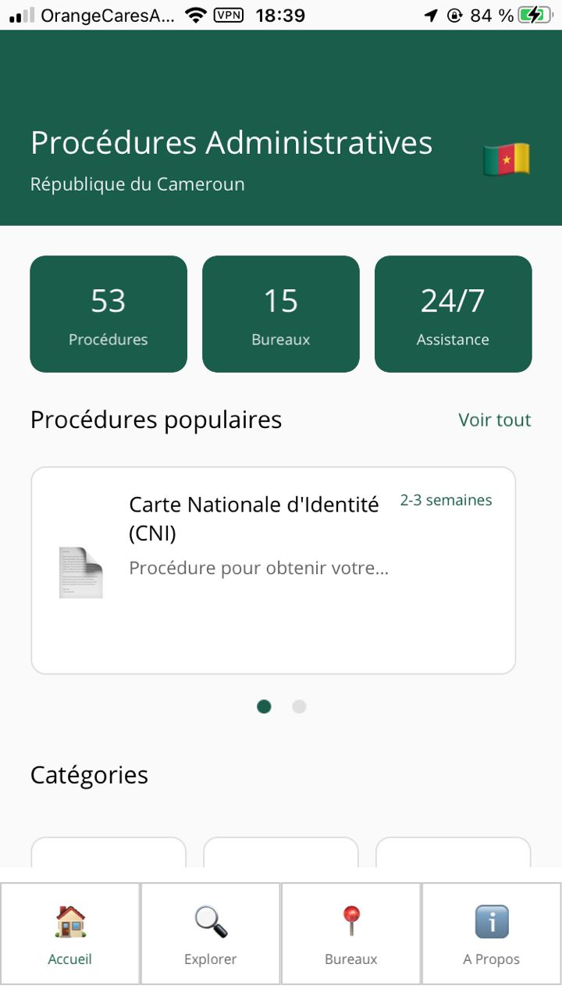
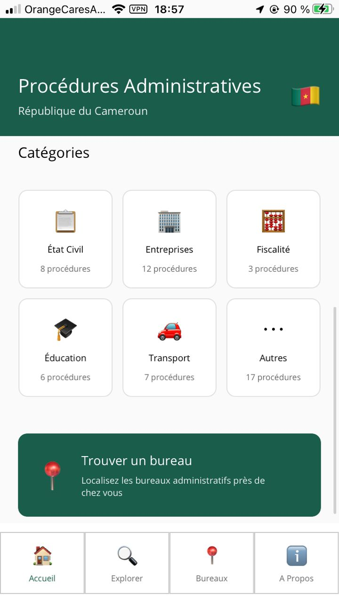
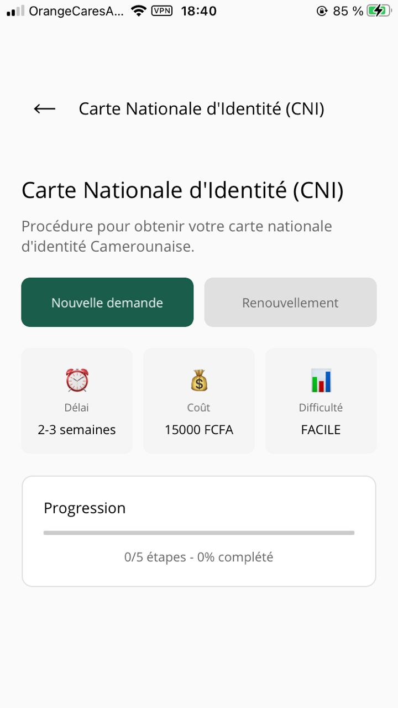
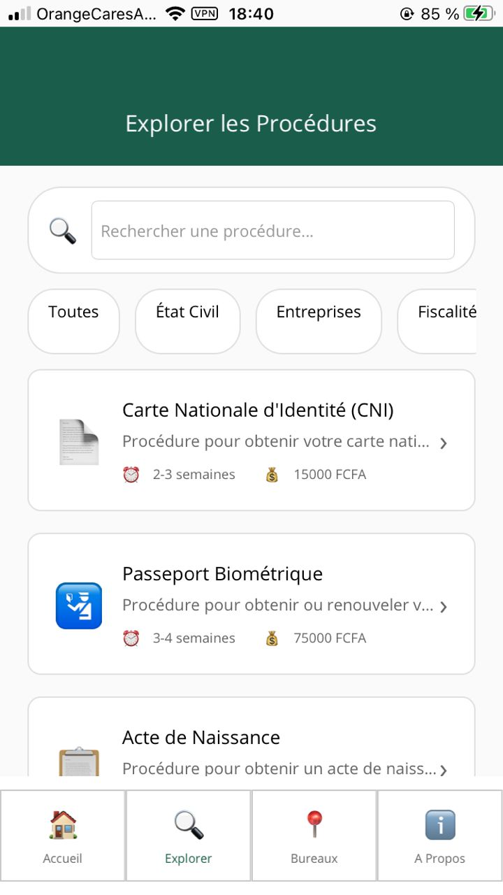
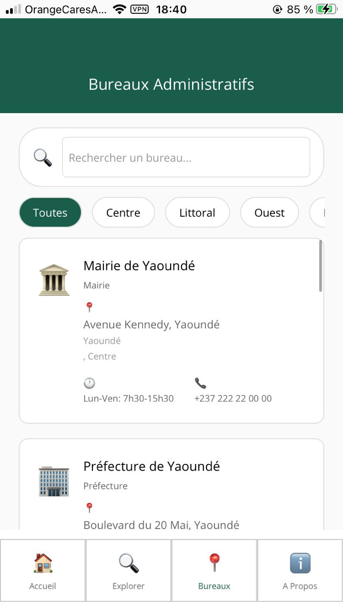
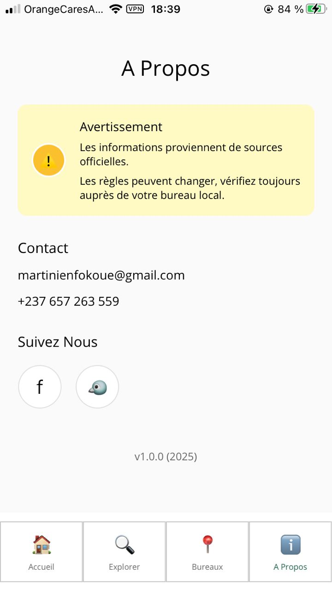

# Procédures Administratives - Cameroun

Application mobile multiplateforme développée avec .NET MAUI pour simplifier les démarches administratives au Cameroun. Cette application guide les utilisateurs à travers les différentes procédures administratives avec des informations détaillées sur les documents requis, les délais, les coûts et les bureaux compétents.

## Description

Cette application a pour objectif de faciliter l'accès aux informations sur les procédures administratives camerounaises. Elle permet aux citoyens de :

- Consulter les procédures administratives disponibles
- Obtenir des informations détaillées sur chaque procédure (documents requis, délais, coûts)
- Localiser les bureaux administratifs les plus proches
- Explorer les procédures par catégorie
- Suivre l'avancement de leurs démarches

## Fonctionnalités

### Page d'accueil
- Vue d'ensemble des statistiques (nombre de procédures, bureaux, assistance)
- Procédures populaires en carrousel horizontal
- Catégories de procédures avec navigation rapide
- Navigation vers les différentes sections de l'application

### Onboarding
- Expérience d'introduction pour les nouveaux utilisateurs
- Présentation des fonctionnalités principales
- Affichage uniquement lors de la première utilisation

### Détails des procédures
- Informations complètes sur chaque procédure
- Détails sur les documents requis
- Délais de traitement
- Coûts associés
- Niveau de difficulté
- Suivi de progression

### Catégories
- Navigation par catégorie (État Civil, Entreprises, Fiscalité, Éducation, Transport)
- Liste des procédures par catégorie
- Accès rapide aux détails

### Exploration
- Recherche de procédures par mot-clé
- Filtrage par catégorie
- Liste complète de toutes les procédures disponibles

### Bureaux administratifs
- Liste des bureaux administratifs au Cameroun
- Informations de contact (adresse, téléphone, email)
- Horaires d'ouverture
- Filtrage par région
- Recherche par nom ou localisation

### À propos
- Informations sur l'application
- Contact et support
- Liens vers les réseaux sociaux
- Avertissements et mentions légales

## Captures d'écran

### Splash Screen


### Onboarding
<table>
<tr>
<td></td>
<td></td>
<td></td>
</tr>
</table>

### Page d'accueil
<table>
<tr>
<td></td>
<td></td>
</tr>
</table>

### Détails d'une procédure


### Détails d'une catégorie


### Exploration des procédures


### Bureaux administratifs


### À propos


## Technologies utilisées

- **.NET MAUI** : Framework multiplateforme pour le développement d'applications mobiles
- **C#** : Langage de programmation
- **XAML** : Langage de balisage pour l'interface utilisateur
- **MVVM** : Pattern d'architecture Model-View-ViewModel
- **Dependency Injection** : Gestion des dépendances avec Microsoft.Extensions.DependencyInjection

## Structure du projet

```
TP/
├── Models/              # Modèles de données
│   ├── Procedure.cs
│   ├── Category.cs
│   ├── Office.cs
│   ├── Statistics.cs
│   └── OnboardingItem.cs
├── ViewModels/          # ViewModels pour le pattern MVVM
│   ├── BaseViewModel.cs
│   ├── HomeViewModel.cs
│   ├── ProcedureDetailViewModel.cs
│   ├── CategoryViewModel.cs
│   ├── ExploreViewModel.cs
│   ├── OfficesViewModel.cs
│   ├── AboutViewModel.cs
│   ├── OnboardingViewModel.cs
│   └── SplashViewModel.cs
├── Views/               # Pages XAML
│   ├── HomePage.xaml
│   ├── ProcedureDetailPage.xaml
│   ├── CategoryPage.xaml
│   ├── ExplorePage.xaml
│   ├── OfficesPage.xaml
│   ├── AboutPage.xaml
│   ├── OnboardingPage.xaml
│   └── SplashPage.xaml
├── Services/            # Services métier
│   ├── INavigationService.cs
│   ├── NavigationService.cs
│   ├── IStorageService.cs
│   ├── StorageService.cs
│   ├── IProcedureService.cs
│   └── ProcedureService.cs
├── Resources/           # Ressources (images, styles, polices)
│   ├── Images/
│   ├── Fonts/
│   └── Styles/
└── Platforms/          # Code spécifique aux plateformes
    ├── Android/
    ├── iOS/
    ├── MacCatalyst/
    └── Windows/
```

## Prérequis

- .NET 10.0 SDK ou supérieur
- Visual Studio 2022 (17.8 ou supérieur) avec la charge de travail .NET MAUI
- Ou Visual Studio Code avec les extensions C# et .NET MAUI
- Pour Android : Android SDK
- Pour iOS : Xcode (sur macOS uniquement)
- Pour Windows : Windows 10/11 SDK

## Installation

1. Cloner le dépôt :
```bash
git clone <url-du-repo>
cd maui/TP
```

2. Restaurer les packages NuGet :
```bash
dotnet restore
```

3. Construire le projet :
```bash
dotnet build
```

## Exécution

### Android
```bash
dotnet build -t:Run -f net10.0-android
```

### iOS (macOS uniquement)
```bash
dotnet build -t:Run -f net10.0-ios
```

### Mac Catalyst (macOS uniquement)
```bash
dotnet build -t:Run -f net10.0-maccatalyst
```

### Windows
```bash
dotnet build -t:Run -f net10.0-windows10.0.19041.0
```

## Architecture

L'application suit le pattern **MVVM (Model-View-ViewModel)** :

- **Models** : Représentent les données de l'application
- **Views** : Interface utilisateur définie en XAML
- **ViewModels** : Logique métier et état de l'interface
- **Services** : Services réutilisables (navigation, stockage, données)

### Services principaux

- **NavigationService** : Gère la navigation entre les pages
- **StorageService** : Gère le stockage local (préférences utilisateur)
- **ProcedureService** : Fournit les données des procédures administratives

## Fonctionnalités techniques

- Navigation avec Shell
- Stockage local des préférences utilisateur
- Architecture modulaire et extensible
- Interface utilisateur responsive
- Support multi-plateforme (Android, iOS, macOS, Windows)

## Contribution

Les contributions sont les bienvenues. Pour contribuer :

1. Fork le projet
2. Créer une branche pour votre fonctionnalité (`git checkout -b feature/AmazingFeature`)
3. Commit vos changements (`git commit -m 'Add some AmazingFeature'`)
4. Push vers la branche (`git push origin feature/AmazingFeature`)
5. Ouvrir une Pull Request

## Avertissement

Cette application est un guide informatif et ne remplace pas les conseils juridiques ou administratifs officiels. Les informations peuvent changer et doivent être vérifiées auprès des autorités compétentes.

## Contact

Pour toute question ou suggestion :
- Email : martinienfokoue@gmail.com
- Téléphone : +237 657 263 559

## Auteur

**Martinien Fokoue**

Développé dans le cadre d'un projet académique.

---

Dernière mise à jour : 2025

